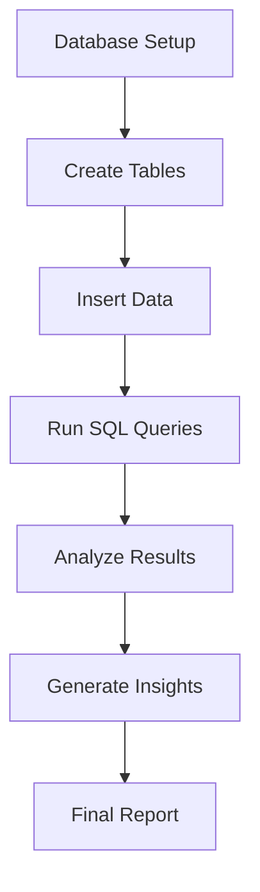

# 🛒 ShopKart SQL Analytics Project
## Project Workflow

---

## 🗂 ER Diagram

---

## 🛠 Tech Stack

* MySQL
* MySQL Workbench
* SQL

---

## 📈 Key Analysis

* Customer Behavior Analysis
* Product Performance
* Revenue by City
* Profit Analysis
* Order Trends

---

## 📊 Key Insights

* Delhi has highest number of orders
* Electronics category generates maximum revenue
* Laptop is most profitable product
* Repeat customers indicate strong retention
* Cancelled orders impact business performance

---

## 📁 Project Files

* `shopkart_project.sql` → All SQL queries
* `ACE_Project_YourName.pdf` → Final report
* `er_diagram.png` → ER diagram

---

## 🚀 How to Run

1. Open MySQL Workbench
2. Import the `.sql` file
3. Run queries step-by-step
4. Analyze output

---

## 👨‍💻 Author

**Your Name**

---

## ⭐ Support

If you like this project, give it a ⭐ on GitHub!
